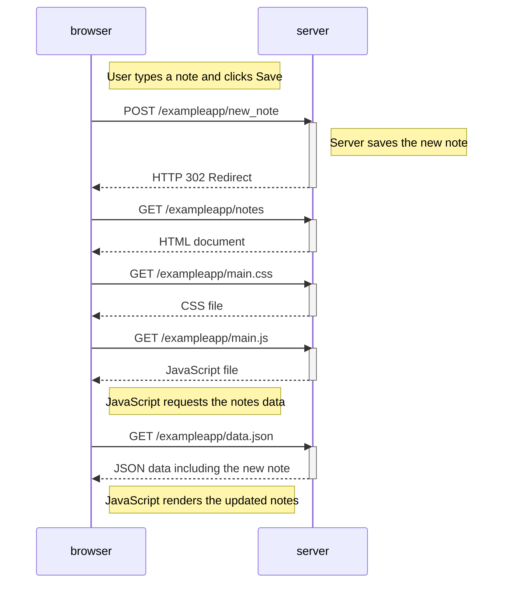

```mermaid
sequenceDiagram
    participant browser
    participant server

    Note right of browser: User types a note and clicks Save

    browser->>server: POST /exampleapp/new_note
    activate server
    Note right of server: Server saves the new note
    server-->>browser: HTTP 302 Redirect
    deactivate server

    browser->>server: GET /exampleapp/notes
    activate server
    server-->>browser: HTML document
    deactivate server

    browser->>server: GET /exampleapp/main.css
    activate server
    server-->>browser: CSS file
    deactivate server

    browser->>server: GET /exampleapp/main.js
    activate server
    server-->>browser: JavaScript file
    deactivate server

    Note right of browser: JavaScript requests the notes data

    browser->>server: GET /exampleapp/data.json
    activate server
    server-->>browser: JSON data including the new note
    deactivate server

    Note right of browser: JavaScript renders the updated notes
```
